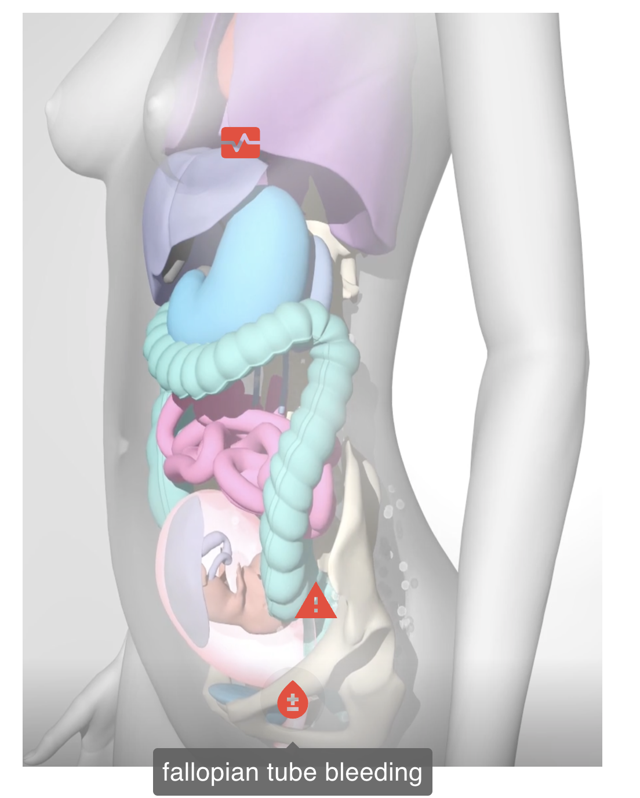
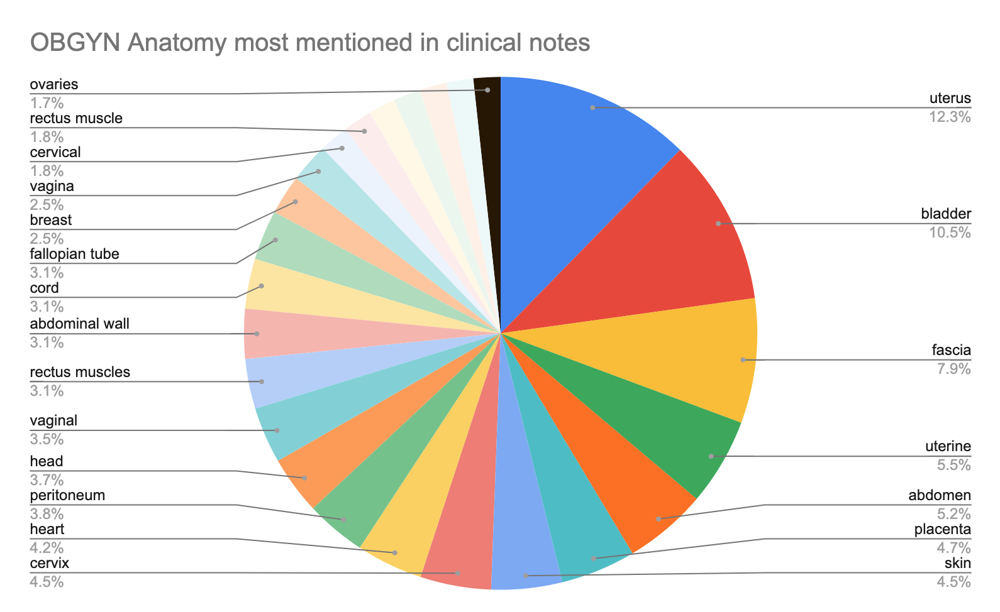
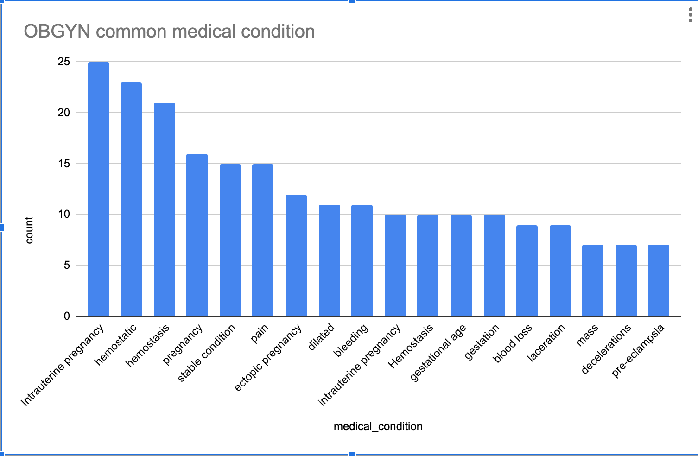

### A playground for health projects
### "Medical Comprehened Render" AKA MCRender

Goal: Visualize medical charts for quick understanding and allowing a broader set of patients, care team members, nursing, and others besides physicians to understand what is in the medical note.  Increase speed and access with visual rendering of dynamic human anatomny with information overlays.

Approach:  Take samples from mtsamples.com for OB/GYN pregancy cases.  Process them through AWS Medical Comprehend, add 2nd level custom processing specific to pregnancy and visualization, store results.  Provide API to data, and sample UI to show two different renders from different notes.

Case 1: ER Visit with problems during pregnancy

Case 2:  Routine OB Ultrasound

Use cases for future would include ER where quick assessment is needed and visually it will greatly help speed for clinician to ramp up on patient.  ER clinicaians also bounce around and see many patients, so visuals help.

Future Tech:  use three.js and have realistic interactive 3D model that is dynamically generated from the medical note.  Translating details of medical note into anotomoically correct 3D model will be graphic design challenge and could open up doors for really interesting new UI.  Eventually clinicians could even use the 3D base model of body to chart.

### License

Copyright © 2022, [Ben Maisano](https://github.com/bjm88).  Not released to public.